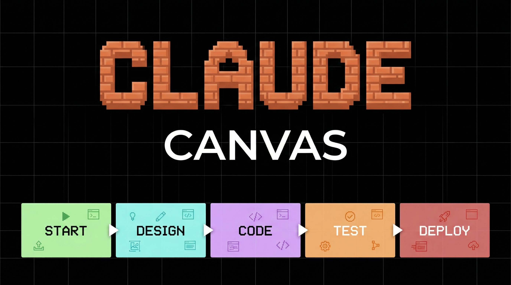
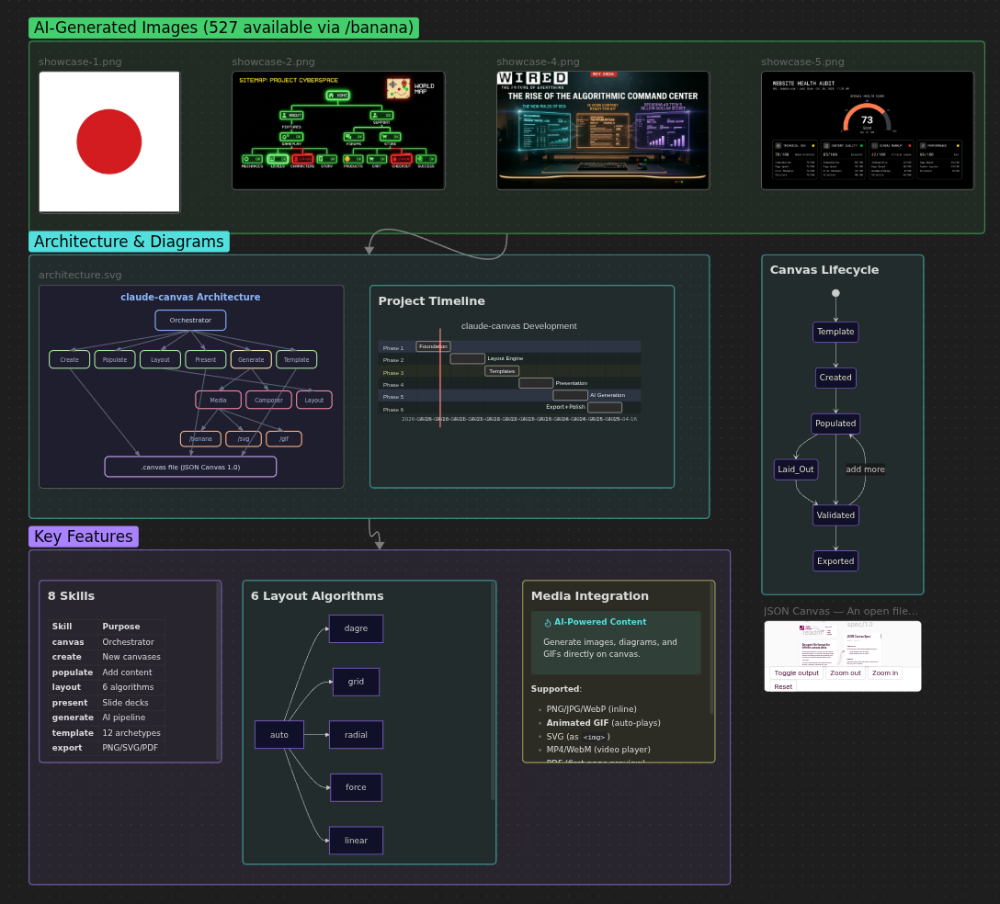
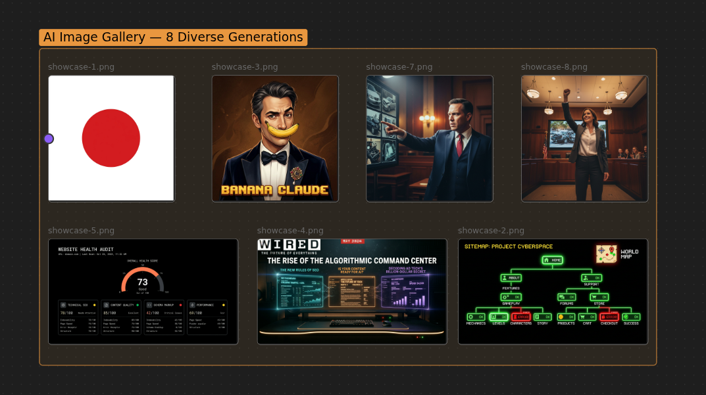
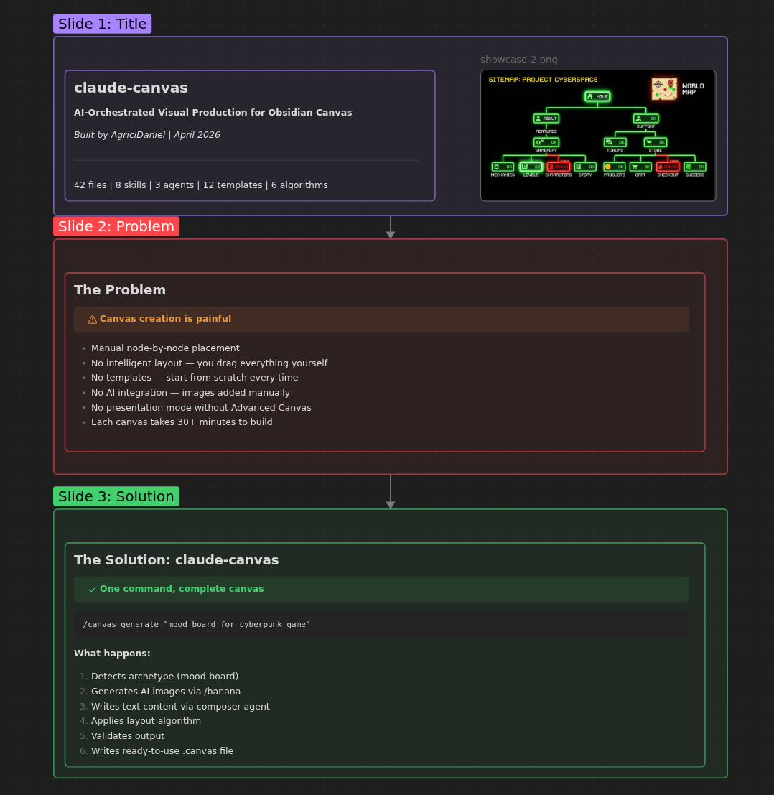
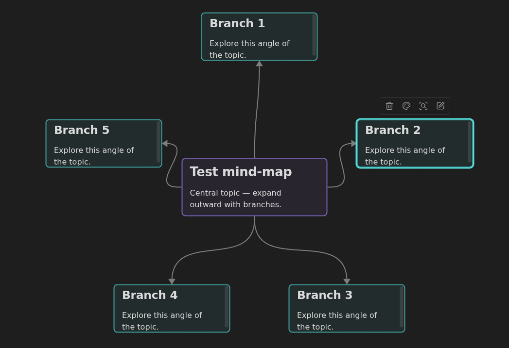
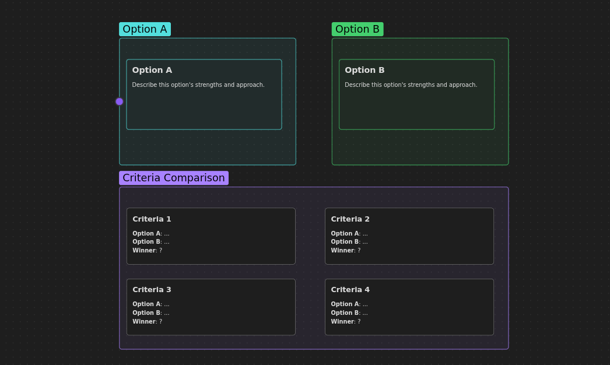
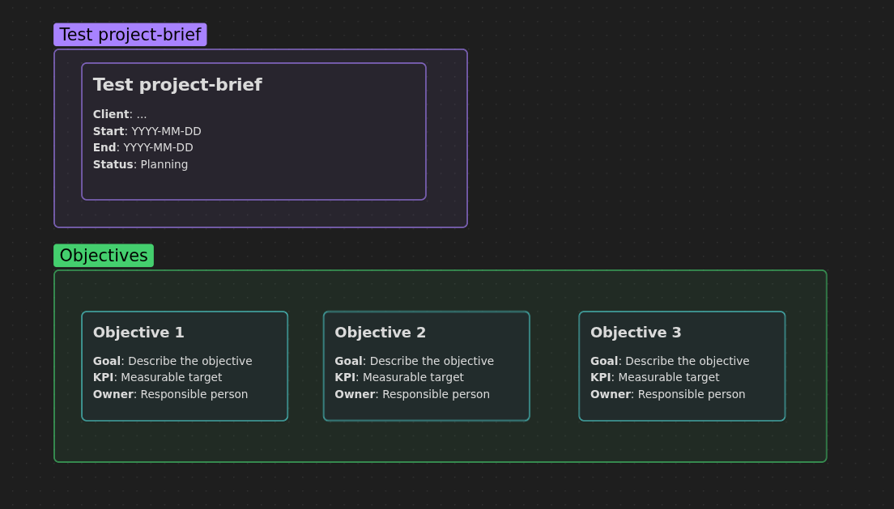

# claude-canvas



AI-orchestrated visual production for [Obsidian Canvas](https://obsidian.md/canvas). Create presentations, flowcharts, mood boards, knowledge graphs, and galleries with intelligent layout and AI-generated content.

Claude acts as **Creative Director** — describe what you want and get a fully populated, professionally laid-out canvas.

## What It Does

- **Create** canvases from 12 built-in templates (presentation, flowchart, mind map, gallery, dashboard, storyboard, knowledge graph, mood board, timeline, comparison, kanban, project brief)
- **Populate** with images, text, PDFs, wiki notes, web links, Mermaid diagrams, SVGs, GIFs
- **Layout** with 6 algorithms (dagre, grid, radial, force-directed, linear, auto-detect)
- **Present** with Advanced Canvas plugin support (1200x675 slide groups with edge navigation)
- **Generate** entire canvases from a single description using AI-generated images and content
- **Export** to PNG, SVG, or PDF

## Install

### Claude Code CLI

```bash
claude plugin install AgriciDaniel/claude-canvas
```

### Clone

```bash
git clone https://github.com/AgriciDaniel/claude-canvas.git ~/Desktop/claude-canvas
```

### Add to existing project

```bash
claude plugin add ~/Desktop/claude-canvas
```

## Commands

| You say | Claude does |
|---------|-------------|
| `/canvas` | List canvases with node counts and zones |
| `/canvas create my-board` | Create a new blank canvas |
| `/canvas create launch from presentation` | Create from template archetype |
| `/canvas add image photo.png` | Add image node with auto aspect ratio |
| `/canvas add text "# Title"` | Add markdown text card |
| `/canvas add banana "hero shot"` | Generate AI image via `/banana`, add to canvas |
| `/canvas add mermaid "graph LR..."` | Add Mermaid diagram (renders natively) |
| `/canvas zone "Research" 5` | Create a cyan-colored zone |
| `/canvas connect node-a node-b` | Add edge between nodes |
| `/canvas from banana` | Import recent AI-generated images |
| `/canvas layout dagre` | Re-layout with hierarchical algorithm |
| `/canvas layout auto` | Auto-detect best algorithm |
| `/canvas present "Q3 Review"` | Build presentation canvas |
| `/canvas generate "mood board for cyberpunk game"` | Full AI-orchestrated generation |
| `/canvas template list` | Browse 12 archetypes |
| `/canvas export png` | Export canvas to PNG |

## Templates

| Archetype | Layout | Use Case |
|-----------|--------|----------|
| `presentation` | Linear vertical | Slide decks for Advanced Canvas |
| `flowchart` | Sugiyama/dagre | Process documentation |
| `mind-map` | Radial center-out | Idea exploration |
| `gallery` | Grid | Image showcases |
| `dashboard` | Grid variable | Project status boards |
| `storyboard` | Linear horizontal | Video/animation planning |
| `knowledge-graph` | Force-directed | Entity relationships |
| `mood-board` | Asymmetric grid | Creative direction |
| `timeline` | Linear horizontal | Event sequences |
| `comparison` | Two columns | Side-by-side analysis |
| `kanban` | Column zones | Task management |
| `project-brief` | Stacked zones | Project kickoff |

## Canvas Location

claude-canvas is **vault-aware but not vault-dependent**:

- If `wiki/canvases/` exists (claude-obsidian vault): uses that directory
- Otherwise: creates `.canvases/` in your current project

## Integration

Works with these skills when installed (gracefully degrades if not available):

- **`/banana`** — AI image generation via Gemini
- **`/svg`** — Diagram, chart, icon, and pattern generation
- **`/claude-gif-*`** — GIF generation, editing, and optimization
- **`mcpvault`** MCP — Read wiki notes for presentation content

## Requirements

- [Obsidian](https://obsidian.md/) with Canvas support (v1.1+)
- [Advanced Canvas](https://github.com/Developer-Mike/obsidian-advanced-canvas) plugin (recommended for presentations and export)
- Python 3.10+ (for layout and validation scripts)

## File Structure

```
.claude-plugin/plugin.json     Plugin metadata
commands/canvas.md             CLI entry point
hooks/hooks.json               PostToolUse auto-validation
skills/
  canvas/                      Main orchestrator — routes to sub-skills
    SKILL.md
    references/                7 reference files (spec, layout, performance, templates, presentation, mermaid, media)
  canvas-create/SKILL.md       Create canvases
  canvas-populate/SKILL.md     Add nodes, edges, zones
  canvas-layout/SKILL.md       Re-layout algorithms
  canvas-present/SKILL.md      Presentation builder
  canvas-generate/SKILL.md     AI-orchestrated generation (flagship)
  canvas-template/SKILL.md     Template browser
  canvas-export/SKILL.md       Export to image/PDF
agents/                        3 agents (layout, media, composer)
scripts/                       Python CLI tools (validate, layout, template)
templates/                     12 JSON Canvas archetypes
bin/setup.sh                   Install optional Python dependencies
```

## Screenshots

### Full Feature Showcase
*AI images, SVG architecture diagram, Mermaid charts, callouts, and zones — all in one canvas*


### AI Image Gallery
*8 diverse AI-generated images arranged in an auto-laid-out gallery zone*


### Presentation Mode
*6-slide deck with real content, Mermaid diagrams, and edge navigation for Advanced Canvas*


### Mind Map (Radial Layout)
*Auto-applied radial layout expanding from central topic*


### Comparison Template
*Side-by-side option zones with criteria comparison section*


### Project Brief
*Stacked zones: header, objectives with KPIs, and deliverables*


## Origin

claude-canvas originated from the `/canvas` skill in [claude-obsidian](https://github.com/AgriciDaniel/claude-obsidian) — a knowledge companion for Obsidian vaults. The original skill handles wiki-scoped visual boards. claude-canvas extends this into a full visual production system for any project.

## Attribution

Built by [AgriciDaniel](https://github.com/AgriciDaniel). Canvas format follows the [JSON Canvas 1.0](https://jsoncanvas.org/) open standard by the Obsidian team.

---

## Author

Built by [Agrici Daniel](https://agricidaniel.com/about) - AI Workflow Architect.

- [Blog](https://agricidaniel.com/blog) - Deep dives on AI marketing automation
- [AI Marketing Hub](https://www.skool.com/ai-marketing-hub) - Free community, 2,800+ members
- [YouTube](https://www.youtube.com/@AgriciDaniel) - Tutorials and demos
- [All open-source tools](https://github.com/AgriciDaniel)
