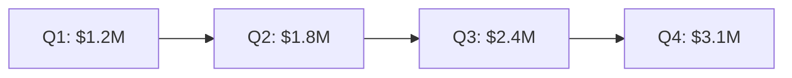

# canvas-present: Presentation Canvas Builder

Read `../canvas/references/presentation-spec.md` for slide dimensions, navigation edges, layout patterns, and color coding.
Read `../canvas/references/performance-guide.md` for node limits.

---

## Operations

### Build Presentation (`/canvas present [topic]`)

Create a complete presentation canvas from a topic description.

**Workflow**:

1. **Gather context**: Ask the user for:
   - Topic/title (required)
   - Number of slides (default: 6, recommend 6-10)
   - Style: `deck` (1200×675 clean) or `storyboard` (1920×1080 with script column)
   - Whether to generate images for slides (requires `/banana`)

2. **Generate slide structure**: Claude writes the content for each slide:
   - Slide 1: Title slide (title, subtitle, date)
   - Slide 2: Agenda/overview
   - Slides 3-N-2: Content slides (key points, data, findings)
   - Slide N-1: Key takeaway / summary
   - Slide N: Next steps / closing

3. **Create the canvas**:

   a. Start from the `presentation` template:
   ```bash
   python3 scripts/canvas_template.py presentation [output_path] \
     --param title="[topic]" --param slide_count=[N]
   ```

   b. Edit each slide's text node with the generated content using the Edit tool.

   c. If images requested: generate via `/banana` and add as file nodes inside slide groups.

   d. If storyboard style: add script annotation text nodes (width=500) to the right of each slide group.

4. **Color-code slides** per the spec:
   - Title/close: `"6"` (purple)
   - Content: `"4"` (green)
   - Key insight: `"5"` (cyan)
   - Action items: `"2"` (orange)

5. **Validate**:
   ```bash
   python3 scripts/canvas_validate.py [output_path]
   ```

6. **Report**: "Created [N]-slide presentation at [path]. Open in Obsidian with Advanced Canvas to navigate with arrow keys."

---

### Build from Notes (`/canvas present from [notes]`)

Create a presentation from existing markdown files or wiki pages.

**Workflow**:

1. **Find source notes**: Search for the specified files. If in a claude-obsidian vault, use `wiki/` paths. Otherwise search the current directory.

2. **Extract content**: Read each note and extract:
   - H1 headings → slide titles
   - H2 headings → slide section markers
   - Key paragraphs → slide body text
   - Images/embeds → slide visuals
   - Bullet lists → slide bullet points

3. **Map to slides**: One H1 or H2 section per slide. If a section is too long (>200 words), split into multiple slides.

4. **Generate canvas**: Follow the same build workflow as `/canvas present [topic]`, using extracted content instead of Claude-generated content.

5. **Report**: "Created presentation from [N] source notes → [M] slides."

---

### Add Slide (`/canvas present add slide [content]`)

Add a new slide to an existing presentation canvas.

**Workflow**:

1. Read the existing presentation canvas.
2. Find the last slide group (highest y for vertical stack, highest x for horizontal).
3. Create a new slide group at the next position:
   - Vertical: `y = last_slide_y + last_slide_height + 100`
   - Horizontal: `x = last_slide_x + last_slide_width + 100`
4. Add content text node inside the new slide group.
5. Add edge from the previously-last slide to the new slide.
6. Write and validate.

---

## Slide Content Guidelines

Each slide should follow the **"one idea per slide"** principle:

- **Title**: 3-8 words. Use H2 (`##`) for slide titles.
- **Body**: 2-5 bullet points OR 1-2 short paragraphs. Max 100 words per slide.
- **Visual**: One image or diagram per content slide. Place to the right of text.
- **Callouts**: Use Obsidian callouts for emphasis:
  ```markdown
  > [!tip] Key Insight
  > The main takeaway in one sentence.
  ```

**Mermaid in slides**: Mermaid diagrams render natively in text nodes. Great for data slides:
```markdown
## Revenue Growth


```

---

## Integration with Media Skills

When the user requests images for slides:

1. **banana**: Generate hero images, backgrounds, illustrations.
   - Prompt pattern: "[slide topic], presentation slide style, clean, professional"
   - Add as file node inside the slide group (half-width, right-aligned)

2. **svg**: Generate charts, diagrams, icons.
   - Best for data visualization slides
   - Add as file node with viewBox-based sizing

3. **Mermaid**: Native in text nodes — no external skill needed.
   - Best for flowcharts, sequence diagrams, gantt charts inside slides

If media skills are not installed, build text-only presentations and suggest: "Install `/banana` for AI-generated slide images."
