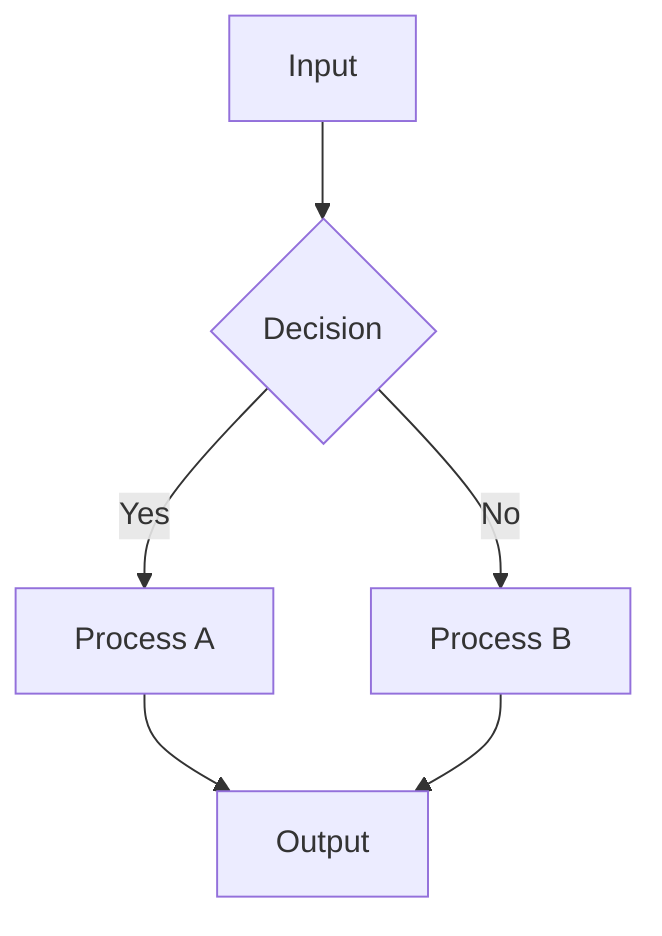
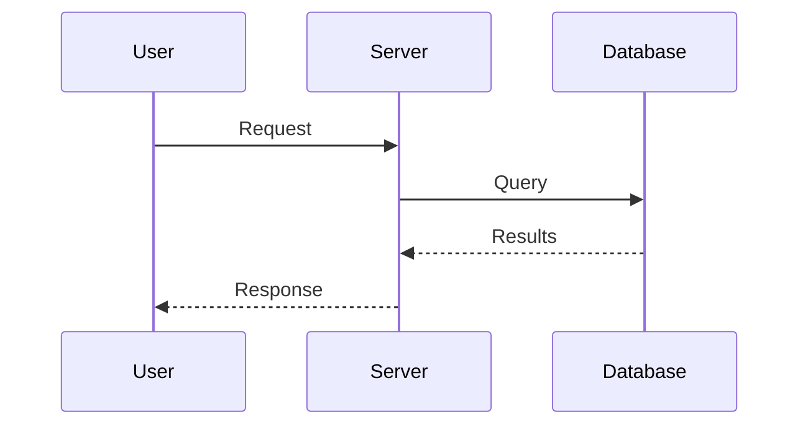
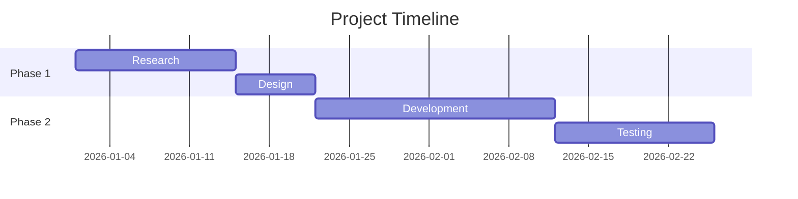
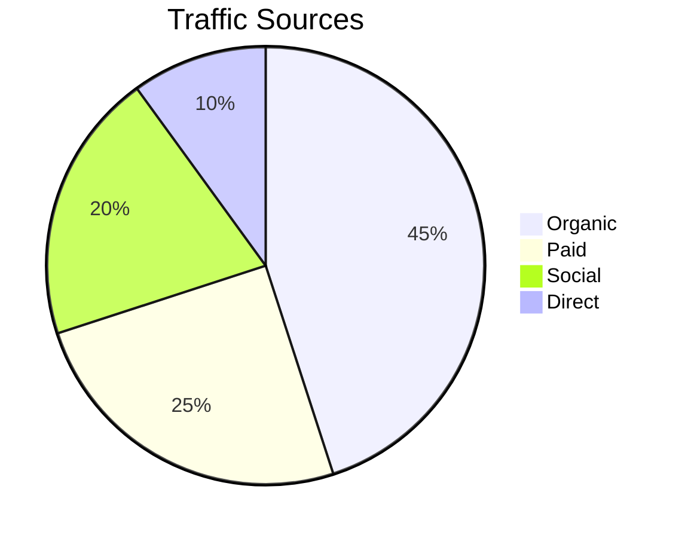
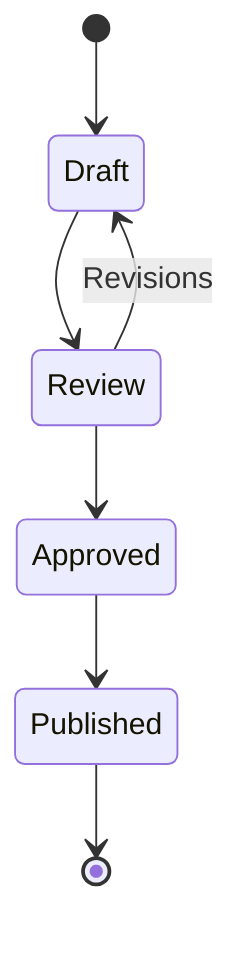
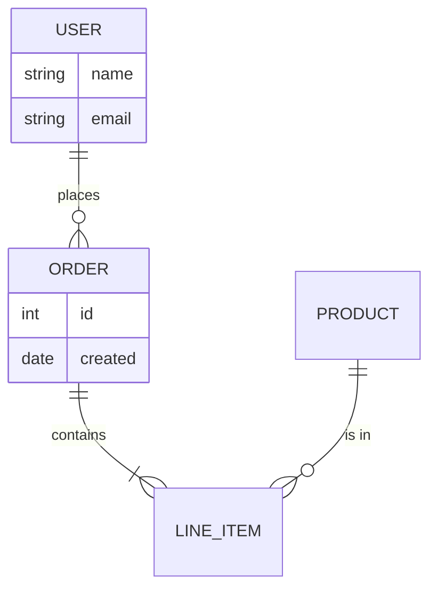
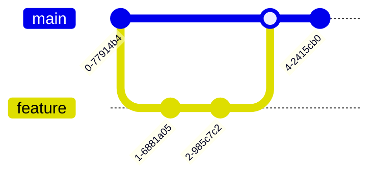

# Mermaid Patterns for Canvas Text Nodes

Mermaid diagrams render **natively** in Obsidian canvas text nodes — no external tools or plugins needed. Wrap the code in a fenced code block inside a text node's `text` field.

---

## How to Embed Mermaid in Canvas

Create a text node with the Mermaid code inside triple backticks:

```json
{
  "id": "text-diagram-1744032823",
  "type": "text",
  "text": "```mermaid\ngraph LR\n    A[Start] --> B[Process]\n    B --> C[End]\n```",
  "x": 0, "y": 0,
  "width": 500, "height": 400,
  "color": "5"
}
```

**Sizing recommendations**:
- Minimum width: 500px (Mermaid needs horizontal space)
- Minimum height: 400px (most diagrams need vertical space)
- **Complex diagrams** (7+ nodes): use 600-700px wide, 500-600px tall
- Mermaid renders INSIDE the text node bounds — if the node is too small, the diagram is clipped or overflows visually
- Always add 40-60px vertical padding below the heading text above the mermaid block
- Use color `"5"` (cyan) for diagram nodes to distinguish from text cards

---

## Supported Diagram Types

### Flowchart (graph)



**Canvas sizing**: width=500, height=400
**Best for**: Process flows, decision trees, system diagrams

### Sequence Diagram



**Canvas sizing**: width=500, height=350
**Best for**: API flows, interaction patterns, timing

### Gantt Chart



**Canvas sizing**: width=600, height=300
**Best for**: Project timelines, sprint planning, scheduling

### Pie Chart



**Canvas sizing**: width=400, height=350
**Best for**: Proportional data, simple breakdowns

### State Diagram



**Canvas sizing**: width=500, height=350
**Best for**: Status flows, lifecycle models, workflow states

### Entity-Relationship Diagram



**Canvas sizing**: width=600, height=400
**Best for**: Database schemas, data modeling

### Git Graph



**Canvas sizing**: width=500, height=300
**Best for**: Branching strategies, release flows

---

## Performance Notes

- Large Mermaid diagrams (20+ nodes) may overflow their text node bounds
- Complex diagrams (50+ elements) cause rendering lag
- Text node height should be generous — Obsidian does not auto-resize for Mermaid
- Mermaid renders on every zoom/pan — keep diagrams under 30 elements for smooth canvas interaction

---

## When to Use Mermaid vs. SVG

| Scenario | Use Mermaid | Use SVG (/svg skill) |
|----------|-------------|---------------------|
| Quick flowchart | Yes | No — overkill |
| Complex architecture diagram | No — limited styling | Yes |
| Data visualization with colors | No — limited palette | Yes |
| Inline in a text card | Yes — native rendering | No — requires file node |
| Needs custom fonts/sizing | No | Yes |
| Live-editable in Obsidian | Yes — edit the text | No — regenerate file |
